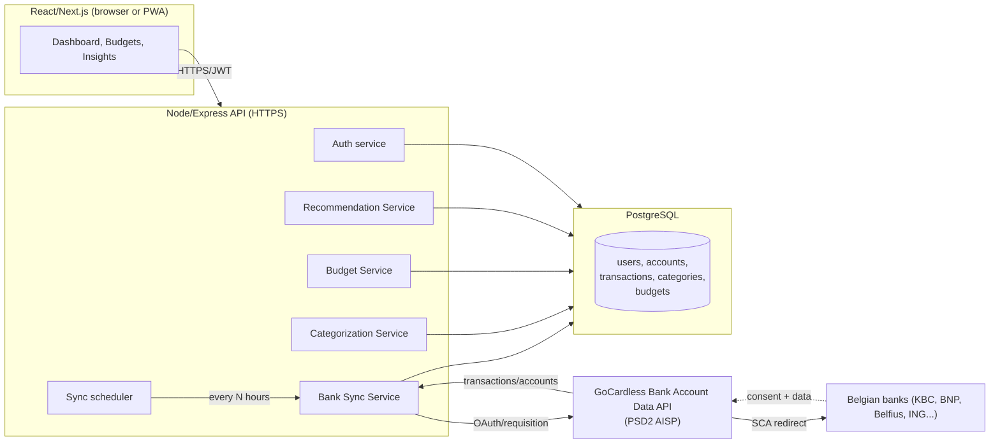

# Belgian Personal Budget App — Design + Starter Code

Stack: **Node.js / Express / TypeScript** backend, **PostgreSQL**, **React (Next.js)** frontend, **GoCardless Bank Account Data API** (PSD2-licensed AISP, free tier, strong Belgian bank coverage — KBC, BNP Paribas Fortis, Belfius, ING, Argenta all supported).

Why Node over FastAPI here: your frontend is already React/Recharts (see the existing budget planner), so one language end-to-end keeps the DTOs, validation schemas, and category-taxonomy constants shareable between frontend and backend without duplication.

---

## 1. Architecture



**Flow summary:**
1. User authenticates (email/password or magic link) → JWT issued.
2. User picks their bank → backend creates a GoCardless *requisition* → user is redirected to their bank's own login (SCA) → bank redirects back with consent granted.
3. Backend stores the requisition/account IDs (never raw bank credentials — GoCardless never sees or stores those either, it's a redirect to the bank's own OAuth).
4. A sync job (cron or on-demand) pulls transactions via GoCardless, normalizes and categorizes them, and stores them.
5. Budget & recommendation services read from the transactions table to compute progress and insights.

---

## 2. Data model

See `db/schema.sql` for full DDL. Core tables:

| Table | Purpose |
|---|---|
| `users` | App accounts |
| `bank_connections` | One row per GoCardless requisition (bank, status, consent expiry) |
| `accounts` | Bank accounts under a connection (IBAN, currency, balance) |
| `transactions` | Synced transactions, linked to `accounts` and `categories` |
| `categories` | User + system spending categories (hierarchical) |
| `budgets` | Monthly budget amount per category per user |
| `recommendations` | Generated insights, so the UI has history and can dismiss/read them |

---

## 3. Key API endpoints

```
POST   /api/auth/register
POST   /api/auth/login
POST   /api/bank/connect              → start a GoCardless requisition, returns bank-selection link
GET    /api/bank/callback             → GoCardless redirects here after SCA
POST   /api/bank/sync                 → trigger a manual sync for the current user
GET    /api/accounts                  → list connected accounts + balances
GET    /api/transactions?month=&category=
PATCH  /api/transactions/:id          → user re-categorizes a transaction
GET    /api/categories
GET    /api/budgets?month=
PUT    /api/budgets/:categoryId       → set/update a monthly budget
GET    /api/insights                  → recommendations for the dashboard
GET    /api/dashboard/summary?month=  → income/expense totals, trend series
```

---

## 4. Security & GDPR notes

- **Tokens**: GoCardless access/refresh tokens encrypted at rest (AES-256-GCM, key in a secrets manager — not in the DB or repo), never sent to the frontend.
- **Transport**: HTTPS everywhere; HSTS; GoCardless requires HTTPS redirect URIs.
- **At rest**: Postgres with encryption at rest (managed Postgres — RDS/Neon/Supabase all do this by default); consider column-level encryption for IBANs.
- **GDPR**: this is financial data of an EU resident, so you need a documented legal basis (consent, via the bank's own SCA flow), a data retention policy (GoCardless historical data is capped at 24 months by most banks), a deletion endpoint (`DELETE /api/account` cascades and also revokes the GoCardless requisition), and a privacy policy naming GoCardless as a sub-processor.
- **Least privilege**: request `balances` + `details` scopes only, not payment-initiation scopes you don't need.
- **Rate limits**: GoCardless free tier caps calls per account per day (historically 4/day) — sync should be scheduled, not triggered on every page load.

---

## 5. Folder structure

```
belgian-budget-app/
├── db/
│   └── schema.sql
├── backend/
│   ├── package.json
│   ├── .env.example
│   └── src/
│       ├── index.ts
│       ├── config/env.ts
│       ├── db/pool.ts
│       ├── middleware/auth.ts
│       ├── services/
│       │   ├── gocardlessService.ts     ← bank sync (core)
│       │   ├── categorizationService.ts ← auto-categorization (core)
│       │   ├── budgetService.ts         ← budget tracking (core)
│       │   └── recommendationService.ts ← insights
│       └── routes/
│           ├── bank.ts
│           ├── transactions.ts
│           └── budgets.ts
└── frontend/                 (not scaffolded here — reuse your existing
                                React/Recharts budget planner's chart
                                components and point them at these endpoints
                                instead of hand-entered data)
```

---

## 6. Roadmap

**Phase 0 — MVP (2–3 weeks solo)**
- Auth, one bank connection via GoCardless, manual sync button, raw transaction list, manual categorization only.

**Phase 1 — Dashboard**
- Auto-categorization (rules below), category/month charts (reuse your existing Recharts components), income vs. expense trend.

**Phase 2 — Budgeting**
- Per-category monthly budgets, progress bars, over/under alerts.

**Phase 3 — Recommendations**
- Rolling 3-month averages per category, rule-based anomaly flags ("+30% vs average"), surfaced on dashboard.

**Phase 4 — Hardening**
- Scheduled sync (cron/queue), token encryption, GDPR deletion flow, multi-account/multi-bank support, refresh-token rotation, audit logging.

---

## 7. What's in this package

Working starter code for the three core services you asked for (`gocardlessService.ts`, `categorizationService.ts`, `budgetService.ts`), the routes that expose them, the DB schema, and app bootstrap (`index.ts`). This runs against a real GoCardless sandbox once you drop in credentials in `.env` — it is not wired to a live database or deployed anywhere, so `npm install && npm run dev` plus a Postgres connection string is the next step on your end.
